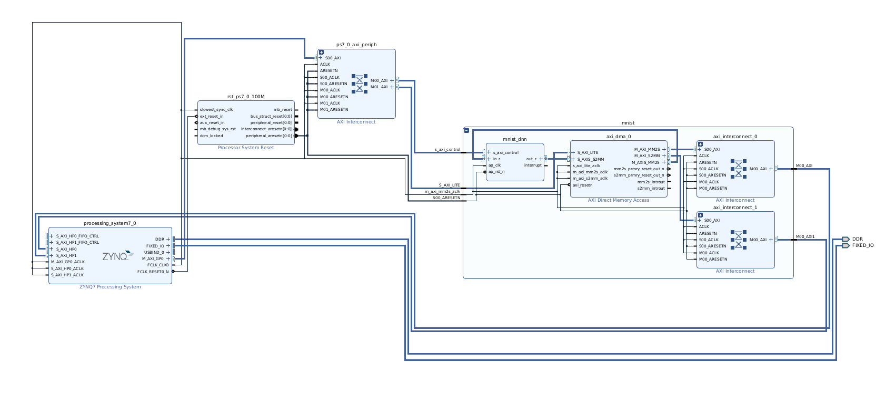

# ELE-548 Final Project: FPGA Python implementation

mnist.bit, mnist.hwh, mnist.tcl: Required files to run the Python Overlay that implements the DNN hardware accelerator.

mnist_wrapper.v: Top level file for the project.

block_diagram.png: Image of the block diagram for the entire system.

NOTE: The full Vivado project is too large to fit onto the Repository. Please contact if the full project is requested.

